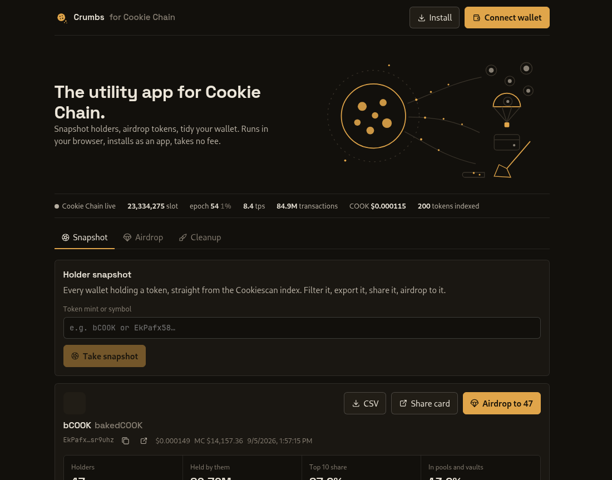
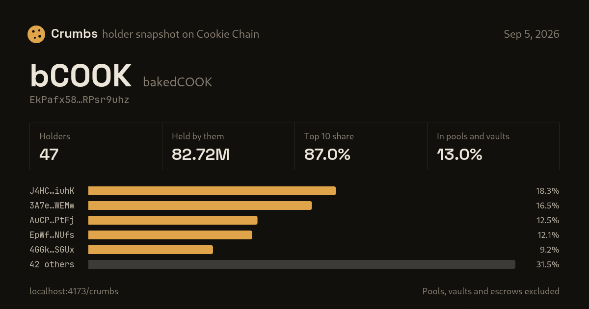
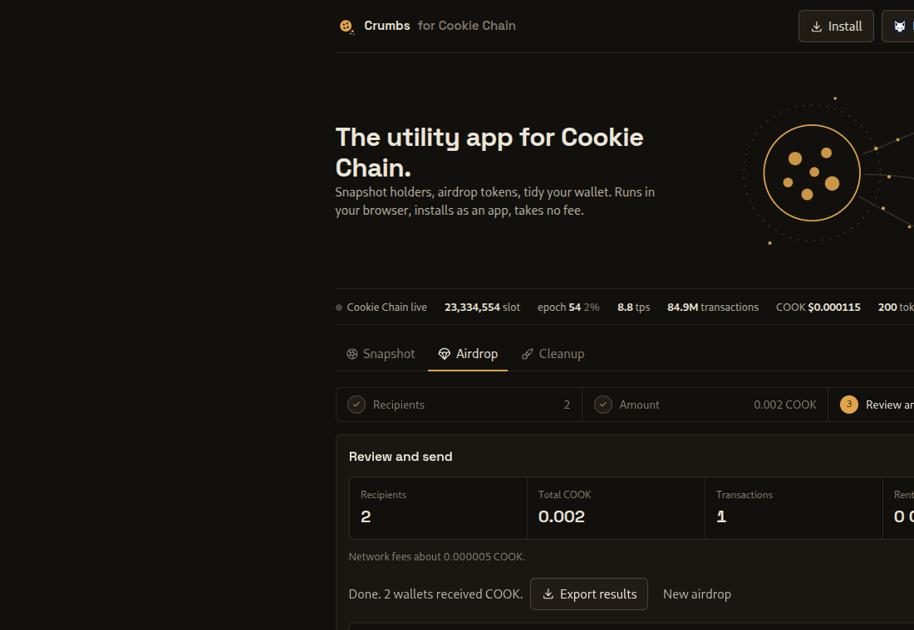

# Crumbs

The utility app for [Cookie Chain](https://www.cookiechain.wtf). Holder snapshots, airdrops and token account cleanup today, more tools as the chain grows. Installable web app, runs entirely in your browser: reads come from the public Cookie Chain RPC and the Cookiescan DAS index, writes are transactions your own wallet signs. No backend, no fees, no keys leave your device.

Live: https://crumbs-cookie.vercel.app/ (mirror: https://wolfurx.github.io/crumbs/)



## What it does

**Snapshot.** Type a token symbol or mint and get every holder from the Cookiescan DAS index, folded by owner (a wallet with several token accounts counts once). Program-owned accounts such as pools, vaults and escrows are flagged and hidden by default so a snapshot means people, not liquidity. You get holder count, a concentration bar (largest holder, top 10, top 50, everyone else), a top-10 chart, a sortable and searchable table, a CSV export, and a share card: a 1200x630 image of the distribution for X or Telegram, rendered in your browser.



**Airdrop.** Three steps: who receives it, what they get, review and send. Send COOK or any SPL / Token-2022 token you hold to a snapshot or to a pasted list. Same amount for everyone, pro-rata to holdings, or an amount per line. Crumbs packs transfers into as few transactions as fit under the 1232-byte limit, creates missing recipient token accounts idempotently, asks the wallet to sign everything in one prompt, then sends and confirms transaction by transaction with live status, Cookiescan links, expiry-aware retries and a results CSV. Costs are shown before you sign: total sent, network fees, and the rent for new accounts (which the recipients can reclaim by closing them).



**Cleanup.** Every token account your wallet owns, across both token programs. Revoke delegates you do not recognise and close empty accounts to get their rent back. No cut is taken.

**And around them.** A live line of chain stats under the hero (slot, epoch, throughput, COOK price, tokens indexed), recent snapshots remembered on this device, an install button when the browser offers one, and a link preview card for every share.

## Using it

1. Install [Nightly](https://nightly.app) and switch its network to **Cookie** (network switcher, top right, under SVM). Nightly ships Cookie Chain as a built-in network, so no custom RPC is needed. Any wallet that speaks the Wallet Standard will connect, but a wallet pointed at Solana mainnet will simulate Cookie Chain transactions against the wrong chain and refuse to sign them.
2. Get a little COOK for fees. Bridge from Solana at https://hyperlane.cookiescan.io, or swap on a Cookie Chain DEX. A 100-recipient airdrop costs well under 0.01 COOK in fees plus about 0.002 COOK of rent per recipient who has no token account yet.
3. Open https://crumbs-cookie.vercel.app/ and install it from the browser menu if you want it as an app. The shell and the token registry are cached for offline use.

## How it works

- Holders come from `getTokenAccounts` on `api.cookiescan.io`, paged 1000 at a time, aggregated by owner. Owners that are not on the ed25519 curve are program addresses and are marked as such.
- Token metadata comes from the Cookiescan registry at `cookiescan.io/api/tokens`; unlisted mints fall back to on-chain decimals.
- Transactions are legacy `Transaction`s with a compute-unit limit sized to their contents. Packing is by measured serialized size, not by a fixed count. Each recipient's instructions stay together in one transaction.
- Signing uses `signAllTransactions` when the wallet offers it, otherwise one prompt per transaction. Confirmation waits on the blockhash's last valid block height; expired transactions are marked so they can be re-signed against a fresh blockhash without resending the ones that landed.
- Native COOK reuses Solana's native mint id (`So111…112`) and has 9 decimals.

## Development

```
npm install
npm run dev          # http://localhost:5173/crumbs/
npm run build        # dist/ with service worker and manifest
npm run preview
```

`scripts/engine-test.ts` runs the airdrop and cleanup code against the live chain with a local keypair (build it with `npx vite build --config vite.engine.config.ts`). `scripts/e2e-snapshot.mjs` drives the built app in a headless Chromium over the DevTools protocol.

Deployed from `main` to Vercel (production) and, as a mirror, to GitHub Pages by Actions. The base path follows the host: `/` on Vercel, `/crumbs/` on Pages.

## Roadmap

Crumbs is meant to be the toolbox every Cookie Chain community reaches for. Next in line:

- Swap by link (in progress): trade any two tokens wallet to wallet, both sides sign one transaction, no escrow, no counterparty risk.
- `.cook` names wherever Crumbs asks for an address.
- Holder snapshots of NFT collections, ready for holder-only airdrops.

The site shows the same list. Suggestions go in the issues or as replies to the launch thread.

## Credits

Built for the Cookie Chain community. Reads run on the Cookiescan DAS API and RPC; the chain's built-in token programs do the rest. MIT licensed.
